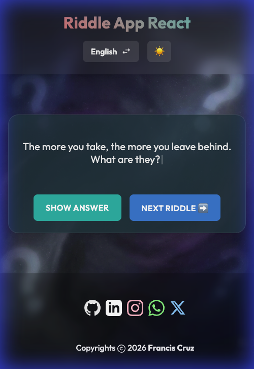
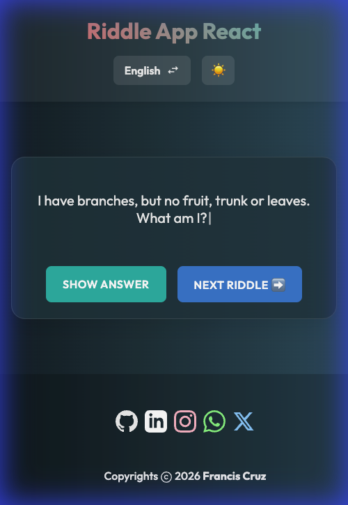
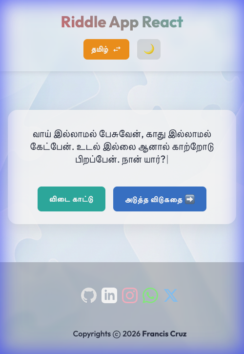

# Riddle App React 🧩

A modern, responsive Progressive Web App (PWA) for riddles in **English** and **Tamil**. Built with React, Vite, and API integration for unlimited fun.

## 🌐 Live Demo

🔗 **Live Site:** 
[https://riddle-app.netlify.app/](https://riddle-app.netlify.app/)

## Features ✨

*   **Unlimited English Riddles 🌎**: Fetches fresh riddles dynamically from the **API Ninjas Riddles API**.
*   **Bilingual Support 🇮**: Switch seamlessly between **English** and **Tamil** (Tamil riddles work offline!).
*   **Dark & Light Modes 🌗**: Beautiful AI-generated abstract backgrounds for both themes.
*   **Progressive Web App (PWA) 📱**: Installable on mobile and desktop, works offline (for localized content).
*   **Responsive Design 📲**: Optimally designed for all screen sizes (Mobile, Tablet, Desktop).
*   **Modern UI to UX 🎨**:
    *   **Outfit Font**: Clean and modern typography.
    *   **Typewriter Effect**: Engaging animations for riddle questions.
    *   **Premium Icons**: Custom 3D App Icon and SVG vector assets.

## Screenshots 📸

| Light Mode | Dark Mode |
| :---: | :---: |
|  |  |

| Mobile View | Tamil Language Support |
| :---: | :---: |
|  |  |

## Tech Stack 🛠️

*   **Frontend**: React 19, Vite
*   **Styling**: CSS3, CSS Variables, Responsive Flexbox
*   **API**: API Ninjas (for English content)
*   **Animations**: AOS (Animate On Scroll), Typewriter Effect
*   **PWA**: Vite Plugin PWA

## Installation 💻

1.  **Clone the repository:**
    ```bash
    git clone https://github.com/ajf013/riddle-app.git
    cd riddle-app
    ```

2.  **Install dependencies:**
    ```bash
    npm install
    ```

3.  **Setup Environment Variables:**
    Create a `.env` file in the root directory and add your API key:
    ```env
    VITE_API_NINJAS_KEY=your_api_key_here
    ```

4.  **Run the development server:**
    ```bash
    npm run dev
    ```

## License 📄

This project is open-source and available under the [MIT License](LICENSE).

## You can reach out 😊😊
Feel free to contact me about the problems. I will try to help as much as I can 😉

[](https://www.linkedin.com/in/ajf013-francis-cruz/)
[](mailto:cruzmma2021@gmail.com)
[](https://github.com/ajf013)